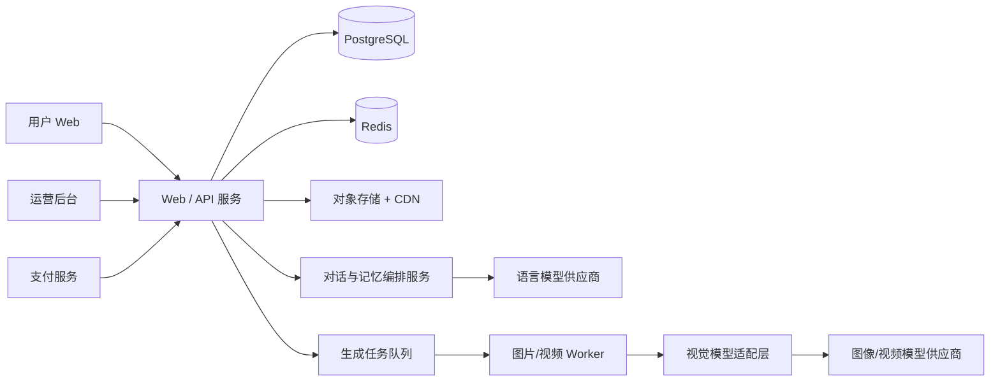
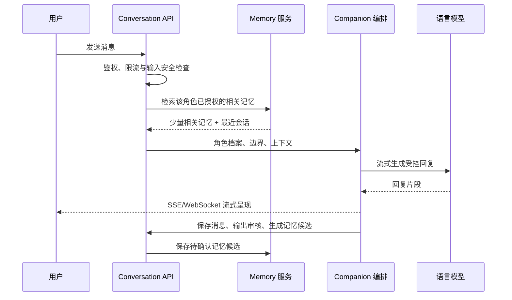
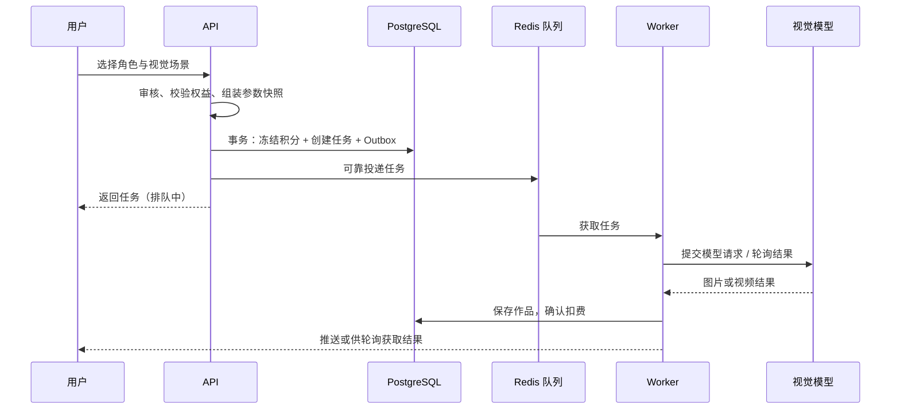

# AI 人物陪伴平台：MVP 实现方案

本方案以 `01-mvp-product-plan.md` 为范围基线。系统核心是“角色 + 对话 + 可控记忆”，图片/视频生成是增强陪伴感的异步能力。

## 1. 总体架构



对话请求应同步快速返回；视觉内容统一转入异步队列。语言模型、视觉模型、支付和存储都使用适配器接口，便于替换供应商。

## 2. 推荐技术选型

| 层级 | 推荐方案 | 说明 |
|---|---|---|
| 前端 | Next.js + TypeScript + Tailwind CSS | 支持聊天流式输出、角色创建与管理后台。 |
| API | NestJS + TypeScript | 适合鉴权、账务、审核、WebSocket/SSE 与模块化领域服务。 |
| 身份认证 | Auth.js / OAuth 2.0 + JWT/安全会话 | 支持邮箱登录，并接入 Google、Facebook 账号登录与账户关联。 |
| 数据库 | PostgreSQL + Prisma | 保存用户、角色、会话、记忆、作品、订单和任务。 |
| 缓存/队列 | Redis + BullMQ | 会话限流、任务优先级、重试和 Worker 调度。 |
| 对话编排 | 独立 `companion` 模块/服务 | 汇总角色档案、近期会话、已授权记忆和安全策略后调用 LLM。 |
| 语义检索 | PostgreSQL pgvector（MVP） | 对记忆嵌入、相似检索，避免过早引入独立向量库。 |
| Worker | Node.js + BullMQ Worker | 图片、视频、媒体处理和审核异步执行。 |
| 文件 | S3 兼容对象存储 + CDN | 角色参考图、生成作品、缩略图和导出文件。 |
| 监控 | Sentry + OpenTelemetry | 跟踪聊天错误、任务耗时、模型成本与支付异常。 |

## 3. 服务模块

- `auth`：账户、年龄确认、会话、RBAC、数据导出/删除请求，以及 Google、Facebook OAuth 登录和账户关联。
- `character`：角色档案、关系模板、人格模板、视觉设定、角色设置。
- `conversation`：会话、消息、流式回复、快捷话题、用户反馈。
- `memory`：记忆候选提取、用户确认、向量检索、编辑/删除与使用审计。
- `companion`：将角色人格、边界、近期消息和检索记忆组装为受控上下文，调用语言模型并执行输出安全检查。
- `asset`：素材上传、预签名 URL、媒体元数据、访问授权。
- `generation`：视觉任务创建、积分冻结、状态查询、作品归档。
- `billing`：套餐、权益、积分流水、订单、第三方支付会话、Webhook 回调与退款补偿。
- `safety`：文本/图片审核、风险检测、举报、人工审核队列和策略版本。
- `admin`：模板、用户、内容、任务、模型、支付与运营控制台。

## 4. 核心数据模型

| 实体 | 关键字段 |
|---|---|
| User | id、账户标识、年龄状态、订阅权益、积分余额、通知偏好 |
| AuthIdentity | userId、provider（email/google/facebook）、providerAccountId、邮箱、绑定时间、最后登录时间 |
| Character | userId、名称、关系模板、人格模板、视觉设定、陪伴偏好、状态 |
| Conversation / Message | characterId、用户消息/角色消息、内容、模型版本、安全状态、时间 |
| Memory | userId、characterId、内容摘要、类型、embedding、来源消息、状态、用户确认、可用范围 |
| Asset | ownerId、对象键、媒体类型、来源、审核状态、访问策略 |
| Work | characterId、源任务、素材、场景模板、时间线展示信息 |
| Template | 类型（关系/人格/场景/风格）、展示配置、提示词片段、策略版本、启用状态 |
| GenerationTask | userId、characterId、输入快照、状态、优先级、积分、供应商任务 ID、错误信息 |
| CreditLedger | userId、金额、类型、关联订单/任务、余额快照 |
| Order / Subscription | 用户、套餐、金额、周期、渠道、支付与权益状态 |
| SafetyEvent | 用户/角色/消息/资产、风险类型、策略版本、处置状态、审计信息 |

`Message`、`Memory` 和 `GenerationTask` 应保存模型/模板/策略快照。记忆不可静默持久化：候选记忆必须有确认状态，用户能够逐条撤销。

## 5. 身份认证与第三方账号登录

MVP 提供邮箱登录以及 Google、Facebook 登录。采用 OAuth 2.0/OpenID Connect 标准流程，Web 端跳转至服务商授权页，回调由认证服务校验后创建或登录本地 `User`。

- 以内部 `User.id` 作为全业务主键，绝不以 Google/Facebook 返回的 ID 直接作为用户主键。
- 每个外部账号映射为一条 `AuthIdentity`；同一用户可绑定邮箱、Google 与 Facebook 多种身份，避免用户误以不同方式登录而出现多个账户。
- 对服务商返回且已验证的邮箱进行谨慎自动合并；存在冲突、未验证邮箱或安全风险时要求用户先验证/确认后再绑定。
- OAuth 回调校验 `state`、PKCE（适用时）、授权码与令牌签名；仅保存必要身份资料，令牌加密存储或不落库。
- 账户设置中提供绑定、解绑和最近登录记录；不允许解绑用户唯一可用的登录方式。
- 首次创建账户后再执行年龄确认、条款同意与通知授权，保证第三方账号登录不绕过产品安全流程。

## 6. 对话与记忆实现



实施约束：

- 系统提示词固定包含 AI 身份声明、情感安全边界和角色不能伪造记忆的规则。
- 只在用户和当前角色的命名空间检索记忆，默认最多注入少量高相关条目，避免“记忆堆砌”。
- 对敏感信息采用更严格策略：默认不自动保存，要求显式确认；对用户删除操作同时删除向量和原文。
- 在高风险危机场景，切换到安全响应策略，不以角色关系语气强化依赖或替代专业帮助。

## 7. 角色视觉生成与队列

角色视觉任务由聊天页或角色主页发起。后端根据角色视觉设定、场景模板、风格模板和可选情境自动组装提示词；用户只提交模板选择与短描述。



- 图片、视频使用独立队列；视频队列低并发且按套餐优先级排序。
- 任务通过数据库事务冻结积分，成功确认，失败/取消追加补偿流水；利用 Outbox 防止账务与队列不一致。
- 模型适配器统一提供 `submit`、`getStatus`、`cancel`、`normalizeResult`、`estimateCost`。
- 图片/视频必须经审核并存入私有对象存储后才能呈现给用户。

## 8. 订阅与第三方支付实现

支付不直接处理或保存银行卡信息。后端创建第三方支付服务商提供的结账会话（Checkout Session/Payment Link），用户在服务商托管的安全收银台完成支付；订阅的创建、续费、取消、扣款失败和退款均以服务商签名 Webhook 为准。

### 支付适配策略

- **国际市场首选 Stripe**：使用 Stripe Checkout 与 Billing 管理订阅、试用、优惠券、账单门户、支付失败重试和税务能力。
- **本地市场可扩展渠道**：通过 `PaymentProvider` 适配器接入符合目标市场的成熟聚合支付或微信支付、支付宝等渠道；业务层不依赖具体厂商 SDK。
- **支付服务与积分分离**：支付成功只确认套餐/积分购买权益；图片和视频消耗仍由内部 `CreditLedger` 和任务结算处理。

支付 Webhook 必须验证服务商签名、记录事件 ID 并按事件 ID 幂等处理。只有收到可信 Webhook 后才更新 `Order`、`Subscription` 和权益；浏览器跳转成功页仅用于展示，不作为到账依据。

建议的适配器接口：`createCheckout`、`createCustomerPortal`、`handleWebhook`、`cancelSubscription`、`refundPayment`。保存外部 customer、subscription、price 与 payment ID，便于对账但不保存敏感支付信息。

## 9. API 轮廓

| 方法 | 路径 | 用途 |
|---|---|---|
| CRUD | `/api/characters` | 创建和管理陪伴角色 |
| GET | `/api/auth/providers` | 获取 Google、Facebook、邮箱等可用登录方式 |
| POST | `/api/auth/link/:provider` | 发起已登录账户的第三方账号绑定 |
| GET/POST | `/api/conversations/:characterId/messages` | 获取消息、发送并流式接收角色回复 |
| CRUD | `/api/memories` | 查看、确认、编辑、删除记忆 |
| GET | `/api/templates` | 获取关系、人格、场景和风格模板 |
| POST | `/api/assets/upload-url` | 获取角色参考图上传地址 |
| POST | `/api/generation-tasks` | 提交角色视觉内容任务 |
| GET | `/api/generation-tasks/:id` | 查看生成任务状态 |
| GET | `/api/characters/:id/timeline` | 获取共同纪念册 |
| POST | `/api/orders` | 创建订阅或积分包订单 |
| POST | `/api/billing/checkout` | 创建第三方托管支付结账会话 |
| POST | `/api/billing/portal` | 跳转至第三方订阅/账单管理门户 |
| POST | `/api/payments/:provider/webhook` | 验签并处理支付回调 |
| POST | `/api/privacy/export`、`/delete` | 数据导出和删除请求 |

## 10. 分阶段开发

### 阶段 A：陪伴闭环

完成邮箱、Google 与 Facebook 登录，模板化角色创建、角色文本聊天、会话历史、显式记忆卡片、角色主页和基础安全策略。先接入一个语言模型与一个文本审核服务。

### 阶段 B：视觉陪伴

完成角色视觉设定、场景/风格模板、图片任务队列、作品时间线、积分冻结与失败补偿。先接一个图片模型；视频只保留架构接口或小范围灰度。

### 阶段 C：商业化与视频

完成 Stripe 或首发市场对应的成熟第三方支付接入、订阅权益、视频生成队列、完整管理后台、监控告警、审核运营台和数据分析。根据成本与留存决定视频是否作为核心订阅权益。

## 11. 部署与安全基线

- Web/API、聊天编排与视觉 Worker 分离部署；聊天服务按连接数扩展，视频 Worker 按成本与供应商限额扩展。
- PostgreSQL 每日备份；Redis 不作为唯一事实来源；所有队列事件可由数据库 Outbox 恢复。
- OAuth client secret、支付密钥仅使用密钥管理服务；OAuth 回调防护、支付回调验签并保证幂等。
- 私有媒体使用短期签名 URL；对话、记忆和视觉内容设定独立访问控制与审计日志。
- 上线前验证：删除链路、危机响应、年龄限制、内容审核、限流、成本上限、错误与异常告警。

## 12. 建议目录

```text
apps/
  web/                   # 用户端、聊天界面和运营后台
  api/                   # 领域 API、SSE/WebSocket 网关
  worker/                # 图片/视频/审核异步消费者
packages/
  db/                    # Prisma schema、迁移、数据访问
  ui/                    # 角色、聊天、模板等共享组件
  contracts/             # DTO、事件、权限与状态枚举
  companion-core/        # 上下文、记忆检索、安全编排
  provider-adapters/     # LLM、视觉模型、支付、存储适配器
infra/
  docker/                # 本地开发与部署
docs/
```

## 13. 开工前需确认的决策

1. 首发市场、法定年龄门槛、Google/Facebook OAuth 应用审核要求、支付渠道与隐私/数据留存要求。
2. 允许的关系类型、角色主动消息频率和危机/心理风险处置规范。
3. 是否允许上传真人参考图，以及肖像权审核策略。
4. 首选语言模型、图像模型、视频模型和目标单位成本。
5. 免费层对话上限、订阅权益、视觉积分定价与水印策略，以及 Stripe/本地支付的首发选择。
